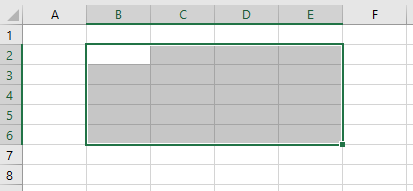

# Establecer y obtener el intervalo seleccionado mediante la API de JavaScript de Excel

En el ejemplo de código siguiente se selecciona el rango B2:E6 en la hoja de cálculo activa.
```javascript
await Excel.run(async (context) => {
    let sheet = context.workbook.worksheets.getActiveWorksheet();
    let range = sheet.getRange("B2:E6");

    range.select(); // selecciona el rango especificado

    await context.sync();
});
```



## Obtener el intervalo seleccionado

```javascript
await Excel.run(async (context) => {
    let range = context.workbook.getSelectedRange(); //Objeto rango seleccionado.
    range.load("values");  // Obtenemos los valores.

    await context.sync(); // sincronizamos con el servidor.
    
    console.log(`The address of the selected range is "${range.values}"`); //imprimimos 
});
```